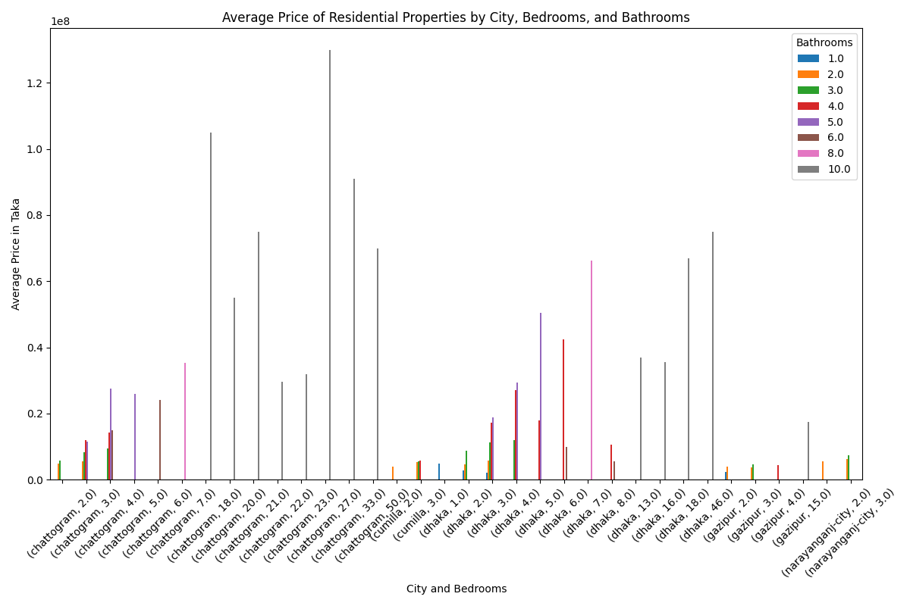
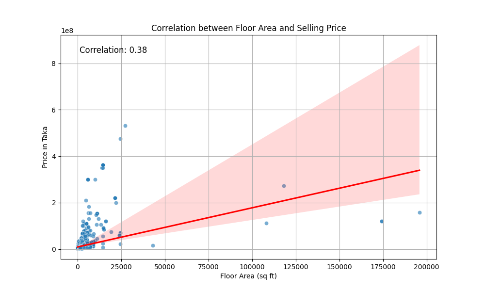
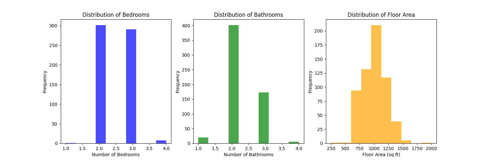
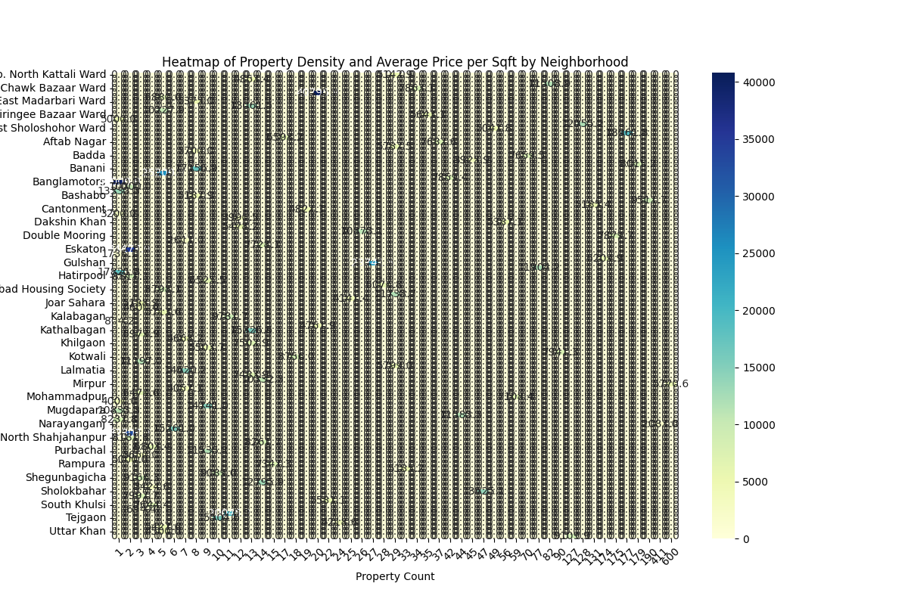

# Executive-Level Report on Real Estate Property Listings Analysis

## Executive Summary
This report presents a comprehensive analysis of a dataset containing residential property listings, focusing on market trends, pricing dynamics, and investment potential across various cities and neighborhoods. The analysis reveals significant insights into average property prices, the impact of property features on pricing, and the identification of high-potential investment areas. Key recommendations are provided to guide strategic decisions in real estate investments.

## Dataset Description
The dataset pertains to the **real estate** domain, specifically focusing on **property listings**. It includes detailed information about residential properties for sale, such as:
- Title
- Number of bedrooms and bathrooms
- Floor number
- Occupancy status
- Floor area
- City
- Price
- Location

This dataset serves multiple use cases, including:
- Analyzing market trends in residential property prices
- Identifying popular locations for real estate investment
- Providing insights for potential buyers on property features and pricing

## Analysis Questions and Answers

### 1. What is the average price of residential properties in different cities, and how does this vary by the number of bedrooms and bathrooms?
The analysis of average residential property prices across different cities, categorized by the number of bedrooms and bathrooms, reveals several key insights:

1. **City-wise Price Comparison**:
   - **Dhaka**: The most expensive city, with a 1-bedroom, 1-bathroom property averaging 4.8 million taka, and a 46-bedroom, 10-bathroom property reaching 75 million taka.
   - **Chattogram**: Notable properties include a 20-bedroom, 10-bathroom priced at 55 million taka.
   - **Cumilla and Narayanganj City**: Lower average prices compared to Dhaka and Chattogram, with Narayanganj City's 3-bedroom, 3-bathroom properties averaging around 7.4 million taka.

2. **Impact of Bedrooms and Bathrooms**:
   - The number of bedrooms and bathrooms significantly influences property prices, with larger properties commanding higher prices.

3. **Property Size and Configuration**:
   - Some entries indicate very large properties, suggesting a market for villas or estates.

4. **Market Trends**:
   - Dhaka's dominance in high-end properties reflects its status as a major urban center.

As shown in the visualization below, the average prices across cities and configurations are illustrated:

### 2. Which locations have shown the highest increase in property prices over the last year, and what factors might be contributing to this trend?
The analysis of property prices across various locations revealed the following insights:

- **Top 10 Locations by Average Property Price**:
  1. Shafipur, Gazipur Sadar Upazila - Average Price: 272,000,000 Taka
  2. Motijheel Road, Motijheel - Average Price: 210,870,000 Taka
  3. Road No 2, Jalalabad Housing Society - Average Price: 188,333,333 Taka
  4. 28 No. Pathantooly Ward, Double Mooring - Average Price: 166,334,444 Taka
  5. Foys Lake, 9 No. North Pahartali Ward - Average Price: 162,666,667 Taka

- **Contributing Factors**:
  - Infrastructure development, economic growth, population increase, proximity to amenities, and transportation improvements are key factors influencing price increases.

### 3. How does the floor area of properties correlate with their selling price, and can we visualize this relationship to identify any outliers?
The analysis shows a moderate positive correlation (Pearson's r ≈ 0.38) between floor area and price, indicating that larger properties tend to have higher selling prices. The scatter plot below visualizes this relationship, highlighting potential outliers.

### 4. What are the most common features (e.g., number of bedrooms, bathrooms, and floor area) of properties that are sold within a specific price range?
The analysis of properties within a specified price range reveals the following key characteristics:
- **Bedrooms**: Average number of bedrooms is approximately 2.5.
- **Bathrooms**: Mean number of bathrooms is around 2.27.
- **Floor Area**: Average floor area is about 998 square feet.
- **Price per Square Foot**: Average price per square foot is approximately $4,258.

The distribution of these features is visualized below:

### 5. Can we create a heatmap to visualize the density of property listings across different neighborhoods, highlighting areas with the most investment potential?
The heatmap visualizes property density and average price per square foot across neighborhoods, indicating investment potential. Key observations include:
- **Mirpur** has the highest property density with 600 properties.
- **22 No. Enayet Bazaar Ward** has the highest average price per square foot at 40,795.93 Taka.

## Key Insights and Recommendations
- **Investment Focus**: Target high-density neighborhoods like Mirpur and areas with moderate average prices for potential investments.
- **Market Trends**: Monitor Dhaka's property market closely due to its high demand and pricing trends.
- **Feature Analysis**: Consider the number of bedrooms and bathrooms as significant factors influencing property prices.
- **Outlier Investigation**: Further investigate identified outliers in pricing to understand market dynamics better.

This report provides a strategic overview of the real estate market, enabling informed decision-making for potential investments and market engagement.