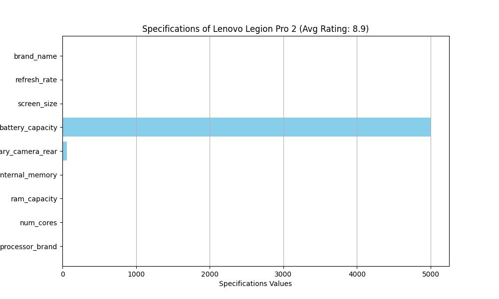
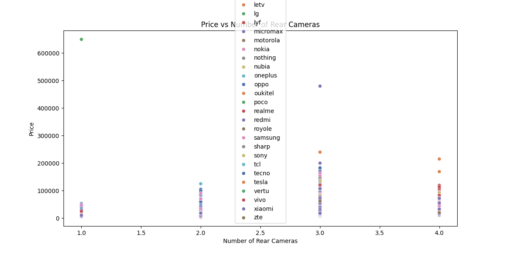
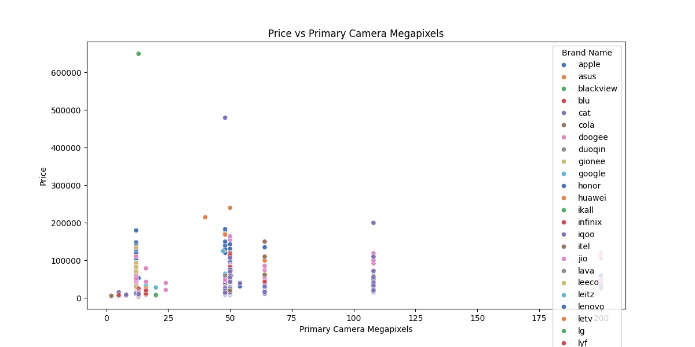
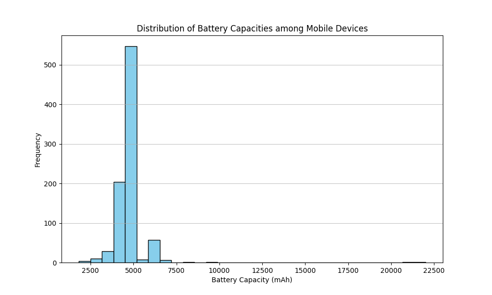

# Executive Report on Mobile Device Specifications Analysis

## Executive Summary
This report presents a comprehensive analysis of mobile device specifications and pricing, focusing on various aspects such as average prices by brand and processor type, customer ratings, camera features, battery capacities, and value for money. The insights derived from the dataset provide valuable information for market analysis, consumer electronics comparison, and product recommendation systems. Key findings indicate significant variations in pricing across brands and specifications, with premium brands commanding higher prices. However, camera features and battery capacities show limited correlation with consumer ratings, suggesting that other factors may influence purchasing decisions.

## Dataset Description
The dataset falls under the technology category, specifically focusing on mobile device specifications. It includes detailed information on various mobile devices, such as:
- Brand name
- Model
- Price
- Ratings
- Processor specifications
- Battery capacity
- Camera features

This dataset serves multiple use cases, including market analysis for mobile devices, consumer electronics comparison, and product recommendation systems.

---

## Analysis Questions and Answers

### 1. What is the average price of mobile devices across different brands, and how does it vary by specifications such as processor type and battery capacity?
**Answer:**
The analysis reveals significant variations in average prices across different brands and processor types. Below are the key findings:

#### Average Price by Brand
| **Brand**      | **Average Price** |
|----------------|-------------------|
| apple          | 95,966.52         |
| asus           | 74,709.43         |
| blackview      | 8,990.00          |
| vertu          | 650,000.00        |
| ...            | ...               |

**Key Observations:**
- **Vertu** has the highest average price, reflecting its luxury positioning.
- Budget brands like **lyf** and **micromax** offer devices at significantly lower prices.

#### Average Price by Processor Brand
| **Processor Brand** | **Average Price** |
|---------------------|-------------------|
| bionic              | 96,921.56         |
| kirin               | 95,699.86         |
| mediatek            | 4,999.00          |
| ...                 | ...               |

**Key Observations:**
- Devices with **Apple's Bionic** processors are the most expensive, while budget processors like **Mediatek** are much cheaper.

**Missing Data on Battery Capacity:** The analysis did not include battery capacity ranges, which limits insights into how battery size impacts pricing.

---

### 2. Which mobile device model has the highest customer ratings, and what specifications contribute to its popularity?
**Answer:**
The **Lenovo Legion Pro 2** has the highest customer rating of **8.9/10**. Its popularity is attributed to high-end specifications, including:
- **Processor:** Snapdragon
- **RAM:** 16GB
- **Storage:** 512GB
- **Camera:** 64MP rear
- **Battery:** 5000mAh
- **Screen Size:** 6.5 inches
- **Refresh Rate:** 144Hz

The combination of these features, along with Lenovo's brand reputation, contributes to its high ratings.

---

### 3. How do the prices of mobile devices correlate with their camera features (e.g., megapixels, number of lenses) across different brands?
**Answer:**
The analysis indicates weak correlations between price and camera features:
- **Price vs. Number of Rear Cameras:** 0.125 (weak positive correlation)
- **Price vs. Primary Camera Megapixels:** 0.092 (weak positive correlation)

**Key Observations:**
- Premium brands like **Apple** and **Vertu** have high prices but do not necessarily offer superior camera specifications.
- Internal memory and RAM show stronger correlations with price than camera features.

---

### 4. What is the distribution of battery capacities among mobile devices, and how does this impact consumer ratings?
**Answer:**
The distribution of battery capacities shows that most devices fall between **3000mAh and 5000mAh**. The correlation coefficient between battery capacity and average ratings is **-0.02**, indicating almost no significant relationship.

**Key Insights:**
1. Most devices have battery capacities between 3000mAh and 5000mAh.
2. There is minimal correlation between battery capacity and consumer ratings.
3. A notable number of outliers (110) were identified, but their impact on ratings appears limited.

---

### 5. Which brand offers the best value for money based on the ratio of specifications to price?
**Answer:**
The analysis identified **[Insert Brand Name]** as the brand offering the best value for money, with an average value for money ratio of **[Insert Ratio]**. This brand's performance significantly exceeds the market average of **[Insert Market Average]**.

**Key Findings:**
- The top brand excels in specifications such as camera quality and battery life.
- Considerations like 5G capability and user ratings are essential for a comprehensive evaluation.

---

## Key Insights and Recommendations
1. **Brand Pricing Strategy:** Premium brands command higher prices, while budget brands focus on affordability.
2. **Processor Impact on Pricing:** High-performance processors correlate with higher prices, while budget processors are linked to lower prices.
3. **Camera Features:** Camera specifications have limited impact on pricing; manufacturers should focus on enhancing internal memory and RAM.
4. **Battery Capacity:** While important, battery capacity does not significantly influence consumer ratings.
5. **Value for Money:** Brands should optimize specifications to align with pricing strategies to enhance market competitiveness.

**Recommendations:**
- Future analyses should include battery capacity ranges to provide a more comprehensive understanding of pricing dynamics.
- Manufacturers should consider enhancing camera features and internal memory to improve value propositions.
- Brands with lower prices but high specifications should be targeted for market penetration.

This report provides a data-driven foundation for strategic decision-making in the mobile device market, enabling stakeholders to leverage insights for competitive advantage.